# Simulador de celda H

> Núcleo numérico y visualizador web para estudiar la electrólisis/ORR en una celda tipo H con trazabilidad completa de ecuaciones.

## Tabla de contenidos

1. [Visión general](#visión-general)
2. [Arquitectura del proyecto](#arquitectura-del-proyecto)
3. [Requisitos](#requisitos)
4. [Instalación y ejecución](#instalación-y-ejecución)
5. [Uso del simulador desde Python](#uso-del-simulador-desde-python)
6. [Uso de la interfaz web](#uso-de-la-interfaz-web)
7. [Datos de referencia y supuestos](#datos-de-referencia-y-supuestos)
8. [Validación y trazabilidad](#validación-y-trazabilidad)
9. [Diagrama de flujo](#diagrama-de-flujo)
10. [Próximos pasos sugeridos](#próximos-pasos-sugeridos)

## Visión general

El repositorio implementa un modelo electroquímico completo para una celda H, con énfasis en:

- **Simulación termodinámica y cinética:** voltaje ideal de Nernst, sobrepotenciales de activación (Tafel), pérdidas óhmicas y de concentración.
- **Análisis DFT de intermedios ORR:** cálculo de barreras energéticas y actividades teóricas para distintos catalizadores.
- **Trazabilidad por punto:** cada evaluación registra la ecuación aplicada, los valores sustituidos y el resultado, facilitando auditorías científicas.
- **Interfaz web interactiva:** control de parámetros en tiempo real, gráficos y tablas descargables.

## Arquitectura del proyecto

```
simulador_celda_H_v2/
├── simulador/                 # Núcleo Python
│   ├── constants.py           # Constantes físicas
│   ├── models.py              # Dataclasses de configuración
│   ├── data.py                # Valores de referencia y catálogo de catalizadores
│   ├── electrochemistry.py    # Ecuaciones (Nernst, Tafel, Ohm, transporte)
│   ├── detail.py              # Registro equation-by-equation (EquationStep, PointDetail)
│   ├── orr.py                 # Energías de adsorción y actividad catalítica
│   ├── simulation.py          # API de alto nivel (ElectrolyzerSimulator, CatalystAnalyzer)
│   └── __init__.py
├── interfaz_usuario/
│   ├── app.py                 # App Dash con sliders, gráficos, tablas y exportación CSV
│   ├── assets/custom.css      # Estilos (tipografía, tooltips, layout)
│   └── requirements.txt       # Dependencias frontend
├── ejemplo_simulador.py       # Script CLI de ejemplo
├── diagrama.svg               # Esquema de arquitectura y flujo
└── README.md                  # Este documento
```

## Requisitos

- Python 3.10+
- Pip actualizado (`python -m pip install --upgrade pip`)
- Entorno Windows/macOS/Linux (probado en Windows)

### Dependencias Python

```
pip install -r interfaz_usuario/requirements.txt
```

Incluye `dash`, `dash-bootstrap-components` y `plotly`. El núcleo no usa librerías externas adicionales.

## Instalación y ejecución

```bash
git clone <repo>
cd simulador_celda_H_v2
pip install -r interfaz_usuario/requirements.txt

# Opción 1: ejecutar ejemplo CLI
python ejemplo_simulador.py

# Opción 2: lanzar la GUI
python interfaz_usuario/app.py
```

Para exponer la app a la red local:

```bash
python -c "from interfaz_usuario.app import app; app.run_server(host='0.0.0.0', port=8050, debug=False)"
```

Luego visitar `http://<IP_LOCAL>:8050/` (la misma instancia incluye la sección de ecuaciones detalladas).

## Uso del simulador desde Python

```python
from simulador import data, detail, simulation

# Configuración por defecto (80 °C, parámetros de Pt)
sim = simulation.ElectrolyzerSimulator(data.DEFAULT_CONFIG)
voltage = sim.voltage(1.0)  # V celda a 1 A/cm2
print(voltage)

# Curva detallada con trazabilidad
currents = [0.2, 0.5, 1.0, 2.0]
points = detail.detailed_curve(currents, sim.config)
for point in points:
    print(point.table_row())        # resumen numérico
    for step in point.steps:        # ecuaciones detalladas
        print(step.name, step.result)
```

### Análisis ORR independiente

```python
from simulador import simulation, data
analyzer = simulation.CatalystAnalyzer(data.CATALYSTS["Pt"], temperature=298.15, pH=0)
activity = analyzer.activity(0.9)
barriers = analyzer.limiting_barriers(0.9)
```

## Uso de la interfaz web

1. Ajusta **Condiciones de operación** (temperatura K, pH) y **Configuración de corriente** (mínima, máxima, muestras, corriente de desglose).
2. Selecciona el **Catalizador** del catálogo (Pt, Pd, Au, Ni, Ir, Rh). Los tooltips “ⓘ” describen técnicamente cada control.
3. La sección **Valores y gráficos** muestra:
   - Tarjetas con: voltaje ideal, pérdidas por activación, ohm y concentración.
   - Curva de polarización interactiva.
   - Actividad relativa (escala log) derivada del módulo `orr.py`.
4. **Datos generados**: tabla resumen (descargable en CSV) y grilla con las ecuaciones evaluadas punto a punto.
5. **Detalle de ecuaciones**: selecciona un punto para ver todas las fórmulas y valores utilizados (contentidos en `detail.py`).

## Datos de referencia y supuestos

- Constantes físicas: Faraday, R, kB, h, etc. (`constants.py`).
- Termodinámica: ΔH°, ΔS°, potencial estándar a 298 K (data ajustable).
- Cinética: corrientes de intercambio y energías de activación para ánodo/cátodo (inputs Arrhenius).
- Resistencias: conductividad de membrana y resistencias de contacto/electrolito.
- Transporte: corriente límite modelada con Arrhenius.
- Catálogo DFT: energías de adsorción O*/OH* y barreras de disociación por metal (Tabla 2 del informe de requerimientos).

Todos estos parámetros pueden modificarse en `simulador/data.py` o sustituyendo `ElectrolyzerConfig` con valores experimentales.

## Validación y trazabilidad

- `simulador/detail.py` produce instancias `PointDetail` con un listado `steps` de `EquationStep`. Cada paso incluye:
  - Nombre de la ecuación (p. ej. “Voltaje ideal”, “Sobrepotencial activación ánodo”).
  - Expresión simbólica (Nernst, Tafel, etc.).
  - Diccionario de valores sustituidos (temperatura, corrientes, i0, etc.).
  - Resultado numérico.
- La GUI usa esta información para mostrar tanto resúmenes como la lista completa de ecuaciones, lo que facilita validar cada término frente a la teoría.

## Diagrama de arquitectura y flujo

En `diagrama.svg` encontrarás un esquema visual listo para insertar en presentaciones o documentos técnicos. Resume:

1. Los módulos principales (`constants`, `models`, `data`, `electrochemistry`, `detail`, `orr`, `simulation`) y sus dependencias.
2. El flujo de trabajo: definición de condiciones, construcción de `ElectrolyzerConfig`, evaluación punto a punto y análisis ORR.
3. Las salidas disponibles (curva de polarización detallada y análisis de actividad catalítica).

Puedes abrirlo con cualquier visor SVG o incrustarlo directamente en reportes para compartir la arquitectura del simulador con otros especialistas.



